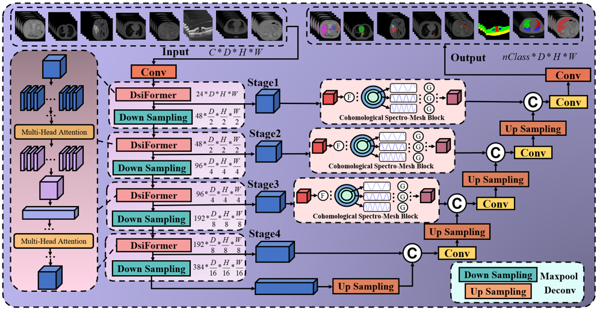
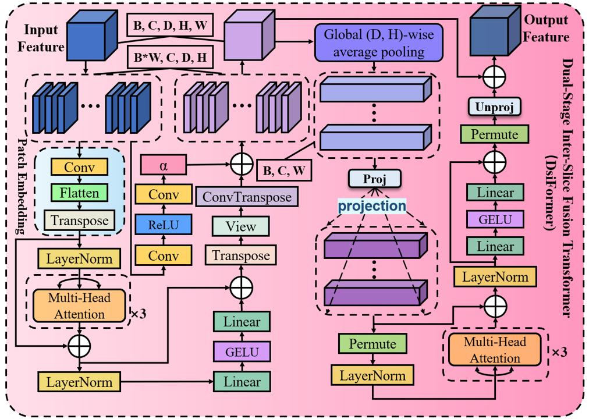
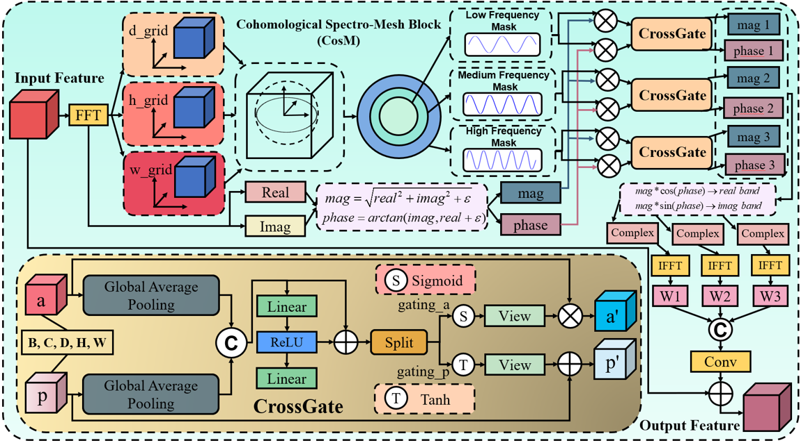

# CADiST: Cohomologically-Augmented Dual-Stage Spectro-Transformative Paradigm for Topology-Preserved 3D Medical Image Segmentation

## Detailed network structure of the CADiST

  

Architectural schematic representation of the proposed CADiST, wherein the DsiFormer effectuates explicit modeling of spatial continuity
between adjacent image slices via dual-level hierarchical attention encoding—initially capturing intra-slice local contextual detail succeeded
by a global inter-slice spatial dependency integration; concurrently, the CosM, situated within decoder skip connections, implements spectral
domain decomposition and cohomological topological constraints, segmenting volumetric frequency spectra into concentric spherical bands and
employing a cross-gating modulation mechanism to integratively refine amplitude-phase characteristics, thereby systematically enforcing anatomical
coherence and structural integrity throughout the segmentation process.

## Detailed Key component structure of the DsiFormer

  

Schematic depiction of the DsiFormer architecture, wherein an initial stage delineates local intra-slice spatial embeddings through convolutional patch embedding, multi-head self-attention, and hierarchical normalization operations; subsequently, a global fusion stage aggregates inter-slice context via dimension-wise global average pooling and projection-enhanced attention mechanisms, thus explicitly encoding volumetric continuity and attenuating inter-slice artifacts inherent in anisotropic three-dimensional medical imagery.

## Detailed Key component structure of the CosM

  

Schematic representation of the CosM, delineating its functional integration of spectral-domain frequency decomposition and cross-gated cohomological modulation, wherein input volumetric features are initially transformed via Fourier spectral decomposition, subsequently partitioned into concentric frequency bands—low, medium, and high—upon which amplitude and phase constituents undergo independent, adaptive CrossGate modulations, effectuating the selective preservation and refinement of anatomical structural coherence and topological integrity; thereafter, inversely mapped spectral features across multiple frequency intervals are concatenated and integrated through convolutional fusion mechanisms, yielding
refined segmentation outputs characterized by enhanced global semantic consistency and anatomical fidelity.

## Datasets

8 well-known publicly available 3D imaging datasets spanning CT, MRI and OCT modalities were enlisted as evaluation benchmarks: BTCV, SegTHOR, MSD Brain Tumour, MSD Lung Tumour, MSD Pancreas Tumour, OIMHS, COVID-19 CT Seg and SLIVER07 are used to validate the proposed model’s efficacy. The dataset splits for training and testing, along with other specific information, are presented in the Table.

## Implementation Details

To enhance segmentation performance, image data was resampled, intensity values clipped, and Min-Max normalization was applied. Additionally, identical data augmentation strategies were employed for all networks to maintain fairness across experiments„ which included random rotation, random shifting, and random scaling of the data. For all training procedures, the DiceCE loss function was adopted, while AdamW served as the optimizer. Image sequence data was randomly cropped into 96×96×96 patches for training, with a batch size of 1, and 320,000 steps of iterative training were carried out. Experiments were conducted on two NVIDIA GeForce RTX 3090 servers, with the environment consisting of Python 3.10, Pytorch 2.1.0, and CUDA 11.8. All experiments were executed under the same hardware and environmental conditions.

